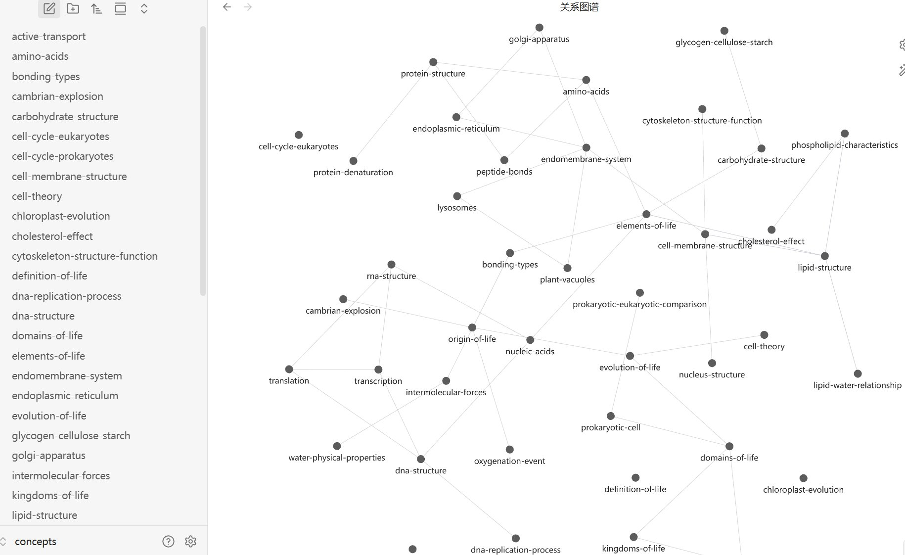

# University of Melbourne Biology Tutor

A formally-verified, personalised knowledge base for first-year **Biology** at the
University of Melbourne (BIOL10002). It turns dense lecture slides into a coherent,
navigable concept map that a student can actually study from — and it refuses to let
any note into that map until the note passes four independent quality gates.

The wiki covers the **entire subject** — *The Chemistry of Life*, *Energy &
Metabolism*, *Genetics*, and *Multicellularity & Physiology* (Lectures 2–36) — as
**171 interlinked concept notes** plus **105 review-question sets**. Every concept is
rewritten in original prose (never transcribed) and checked against a **4C quality
framework** before it is allowed into the graph.

It opens directly in [Obsidian](https://obsidian.md) with **no build step**: searchable,
cross-linked study material with an interactive concept map out of the box.



*The full concept dependency graph in Obsidian's graph view. Each node is one biology
concept; each edge is a prerequisite relationship. The shape of the graph **is** the
learning structure of the subject — and it was assembled automatically from the lectures,
then verified for consistency.*

---

## Why this exists

University lecture decks are optimised for live delivery, not for revision: ideas are
scattered across slides, prerequisites are implicit, and there is no single place to see
how everything connects. This project converts a semester of Biology lectures into a
**single, internally-consistent concept graph** that a learner can browse by topic,
traverse along prerequisite links, search end-to-end, and quiz themselves against.

Just as importantly, the build is **reproducible and auditable**. The same pipeline can
be re-run on next year's lectures, on a different subject, or by a different student, and
the 4C gate guarantees the result is factually grounded, internally coherent, current,
and complete before anyone studies from it.

---

## From knowledge base to video: the course series

The verified concept graph is not only for reading — it is a **source of truth that
generates content**. The same `vault/` published here was used to produce a
**15-episode video series** that teaches the whole subject, lecture-style, from the
chemistry of life through to development and physiology.

▶️ **Watch the full series:** [YouTube playlist](https://www.youtube.com/playlist?list=PLTYuk9ln66s0)

| # | Episode | Link |
|---|---------|------|
| E01 | Foundations of Life & Water Chemistry | https://youtu.be/K2mLrgmXGuI |
| E02 | Biomolecules | https://youtu.be/l4qbN6AjWN8 |
| E03 | Membranes & the Endomembrane System | https://youtu.be/8qi18SNCZ2k |
| E04 | Eukaryotic Origins & Cell Division | https://youtu.be/xqrDJPE2FOY |
| E05 | Bioenergetics & Enzymes | https://youtu.be/ma4t8zB-JdU |
| E06 | Cellular Respiration | https://youtu.be/RpwbinTMyZA |
| E07 | Photosynthesis & Signalling | https://youtu.be/5xem3Dditqk |
| E08 | Genes, Mutation & Variation | https://youtu.be/aHiGQ-TbB7o |
| E09 | Meiosis & Mendelian Inheritance | https://youtu.be/lA75FyEzGzc |
| E10 | Linkage, Gene Interactions & Regulation | https://youtu.be/2QP45eHU130 |
| E11 | Multicellularity & Gas Exchange | https://youtu.be/OZgvrW7oPxI |
| E12 | Transport in Animals & Plants | https://youtu.be/MTdgcfsP5DU |
| E13 | Cell Communication & Homeostasis | https://youtu.be/euO7C_A48Io |
| E14a | Development & Differentiation | https://youtu.be/NyaWYK6XfKE |
| E14b | Tissues & Organs | https://youtu.be/NSGLXyC4jYs |

### How the videos are made

Each episode is generated **from the verified vault**, not hand-scripted and not
improvised by a language model. The 36 lectures roll up into 15 concept-cluster
episodes, and **every spoken claim traces back to a 4C-verified concept note** — the
same auditability guarantee that governs the graph. The per-episode pipeline is:

- **Content derivation** — an episode's assigned concept notes become a narration
  script in original prose, with every factual sentence tagged to its source note. A
  per-episode 4C self-check confirms zero unsourced claims before rendering; gaps are
  flagged, never invented.
- **Slides** — generated programmatically (pptxgenjs) on a consistent dark theme.
- **Animation** — concept animations rendered with Manim where they aid understanding.
- **Voice** — narration synthesised with neural text-to-speech (edge-TTS) at a steady
  lecture pace.
- **Assembly** — all tracks are composited into a single H.264/1080p video, closing
  with a short recap quiz drawn from the linked question sets.

The series is an end-to-end demonstration of the project's thesis: a **4C-verified
personal knowledge base can act as a living source that emits trustworthy,
multi-format study material** — here, a full course of video lectures whose factual
content is auditable back to the graph.

> The videos are an **independent study aid**. They are not affiliated with or endorsed
> by the University of Melbourne, and the lecture slides remain © University of Melbourne
> (used only as a local extraction source, per C1).

---

## The 4C design framework

The core design principle is simple to state and strict to enforce:

> **No note enters the knowledge base unless it passes all four C-gates.**

The four gates generalise the author's *AutoKB-Bench* 4C evaluation framework to a
teaching wiki. They are enforced on every build by the project's internal verification
engine (a Python gate plus an optional Prolog rule layer). A build is reported **green**
only when **C1, C2 and C4 pass with zero violations**; **C3** is advisory.

> **Open knowledge base, closed method.** The 4C *design principles* are documented here in
> full, but the *implementation* — the verification engine, the stitcher, and the Prolog
> rule set — is the author's research IP and is **not** included in this public repository.
> What this repo publishes is the **verified result** (the concept graph), not the algorithm
> that produced and checked it.

### C1 — Correctness
*Is each note factually sound and legitimately sourced?*

- Concept notes must be **original rewrites**, not slide transcriptions. This is both an
  accuracy requirement (explain the idea, don't echo a bullet point) and the project's
  **copyright red line** — the lecture slides are © University of Melbourne and may be
  used only as a local extraction source.
- Structural correctness is checked too: difficulty values stay in range, provenance
  fields are present, and publish-gating flags are well-formed.

C1 is the gate that makes the wiki *honest*: it contains the author's own explanations of
Melbourne's biology, not a redistributed copy of Melbourne's slides.

### C2 — Consistency
*Does the knowledge graph hold together?*

- **Prerequisite links form a directed *acyclic* graph (DAG).** A concept can never, even
  transitively, be its own prerequisite — so there is always a valid order to learn the
  subject in. Cycles introduced by the language model are detected and broken
  deterministically during stitching.
- Every `[[wikilink]]` **resolves** to a note that exists — no dangling references.
- Concept **ids are unique**.
- Every review question points at a concept that **actually exists** in the graph.

C2 is what makes the graph *navigable and trustworthy*: follow any prerequisite chain and
you will never loop, never hit a dead link, and never be sent to a concept that was never
written.

### C3 — Currency
*Is the material still in step with the syllabus?*

- Each note carries a `last_reviewed` date. Staleness is surfaced as an **advisory**
  signal so content can be refreshed when a lecture changes, without blocking a build.

C3 keeps a multi-year knowledge base from silently drifting out of date.

### C4 — Completeness
*Does the wiki cover everything the subject asks the student to learn?*

- Learning outcomes are **harvested directly from the lecture slides** during extraction.
- C4 then checks that **every harvested learning outcome is covered by at least one
  concept note**. A syllabus objective with no concept behind it is a completeness
  violation.

C4 is the gate that turns "a pile of notes" into "a faithful map of the subject": if the
lectures teach it, the wiki contains it.

---

## How it's built (the pipeline)

```
 lecture PDFs            concept notes              clean graph         4C report
 (local only)  ──▶  ─────────────────────  ──▶  ───────────────  ──▶  ───────────
   MarkItDown      GLM-4-flash rewrite          stitch               4C verify
   (PDF → md)      (md → concept notes)     (normalise / break       (C1·C2·C3·C4)
                    + harvest objectives      cycles / rebuild         [private engine]
                                              topic indexes)
                                                     │
                                                     ▼
                                          link_questions.py
                                    (review docs → question notes,
                                       linked to their concepts)
```

1. **Convert** — Microsoft **MarkItDown** turns each lecture PDF into Markdown.
   *Source slides never leave the local machine and never enter the repository.*
2. **Rewrite** — **Zhipu GLM-4-flash** rewrites each lecture into a set of concept notes
   in original prose and harvests that lecture's learning outcomes. The prompt (embedded
   in the extractor) forbids transcription and meta-openers, demands full-sentence
   objectives and explanatory overviews, and keeps prerequisites minimal.
3. **Stitch** — an internal stitcher normalises YAML, prunes dangling prerequisites,
   **breaks any prerequisite cycles**, and rebuilds the four topic-index notes
   (deterministic, no model calls).
4. **Verify** — the internal **4C engine** runs the gates and prints the report.
5. **Link questions** — `extract/link_questions.py` attaches each chapter's
   review-question sets to that lecture's concepts (kept `publish: false`; the AI that
   authored each question is recorded locally and never surfaced).

> Steps **3–4 are the project's core method** (the 4C verification IP) and are kept private.
> This repository ships their **output** — the verified vault — not their code.

---

## Repository layout

```
vault/
  concepts/     171 concept notes — one idea each, prerequisite-linked
  topics/       4 topic-index notes — auto-assembled from the concepts
  _templates/   note schema
extract/
  lecture_to_notes.py    lecture markdown → concept notes (MarkItDown + GLM)
  link_questions.py      review docs → question notes (offline, no API)
README.md
docs/obsidian-graph.png
```

**Deliberately *not* in the repository** (git-ignored to protect copyright and the core
method): the raw lecture PDFs, the converted lecture Markdown, the review-question source
documents, the question notes, and — most importantly — the **entire 4C verification
engine** (`verify/`: the verifier, the stitcher, and the private Prolog rule set).

---

## Getting started

### Study it (recommended) — Obsidian, zero build
1. Install [Obsidian](https://obsidian.md) (free).
2. **Open folder as vault** → choose the `vault/` directory.
3. Browse by topic, follow `[[prerequisite]]` links, full-text search, and open the
   **graph view** to see the concept map above. Obsidian watches the folder, so anything
   you regenerate appears live.

### Regenerate or extend it
The included `extract/` scripts convert lectures and link review questions
(Python 3.10+, `pip install "markitdown[all]" zhipuai PyYAML`, with `ZHIPUAI_API_KEY` set
and any VPN/proxy off for the Zhipu endpoint):

```bash
python extract\lecture_to_notes.py "md\<lecture>.md" --topic <N> --md
python extract\link_questions.py vault
```

The **stitching and 4C verification** that normalise, de-cycle, and validate the graph are
performed by the project's private engine (see *Open knowledge base, closed method* above),
so the `vault/` published here is the canonical, already-verified output. A fork that builds
a different subject would supply its own verification step.

---

## Copyright & privacy

- Lecture slides are **© University of Melbourne** and are used **only** as a local
  extraction source. They are never committed, published, or redistributed.
- Concept notes are **original rewrites**, not slide transcriptions — enforced as **C1**.
- Review questions and the private reasoning/rule layer are **excluded** from the public
  repository.

---

## Future development

1. **Layer 2 — tutoring agent.** A private mastery-tracking tutor with Prolog
   prerequisite-gating (a concept unlocks only once its prerequisites are mastered),
   deployed to a private Hugging Face Space and reusing this verified concept graph.
2. **Optional public site.** Publish the *concept* layer via Quartz / GitHub Pages, with
   questions and private logic filtered out.
3. **Richer objective coverage.** Append (rather than overwrite) per-lecture learning
   outcomes so topic-level completeness text is fully populated.
4. **Whole-course question banks.** Ingest the two cross-topic revision banks as
   course-level question sets.
5. **Spaced repetition / quiz mode** over the linked question sets.

---

## Acknowledgements

Built with [MarkItDown](https://github.com/microsoft/markitdown),
[Zhipu GLM](https://bigmodel.cn), and [Obsidian](https://obsidian.md). The 4C framework is
adapted from the author's
*AutoKB-Bench* evaluation work.

Concept text is original and authored for this project. Underlying lecture material is
© University of Melbourne and is **not** distributed here. If you publish a fork, choose a
license that reflects this split (for example MIT for the code, CC-BY for your own notes)
and keep the copyright and privacy rules above intact.
